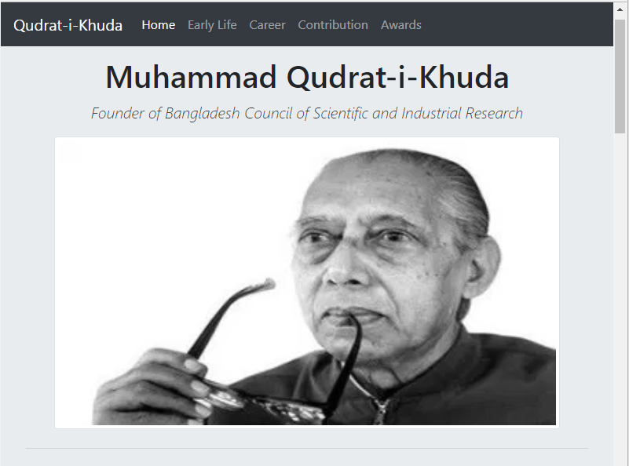
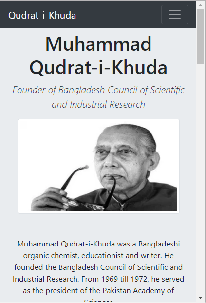
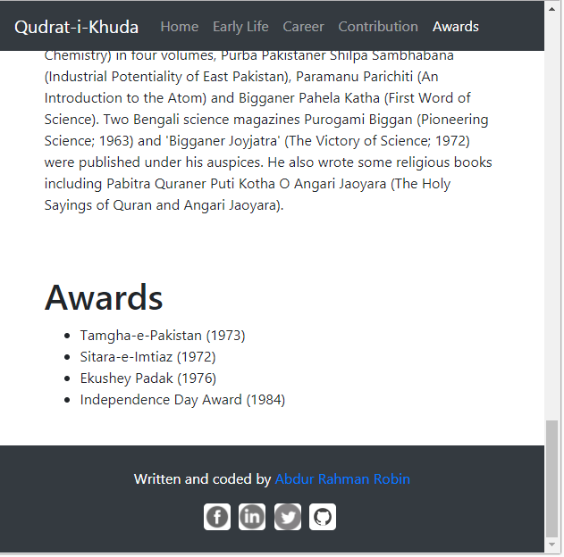

# A-Tribute-Page-of-Qudrat-i-Khuda
A tribute page of Dr. Qudrat-i-Khuda. A super responsive simple web page.
## See this project as a video [YouTube](https://youtu.be/R8vIkvO4zGE)
## Computer Screen

## Mobile Screen

## End Of The Page

## Built with
- HTML5
- CSS3
- JavaScript
- JQuery
- Bootstrap4

This project is the symbol of honour to Dr. muhammad Qudrat i khuda.

## Made By
[Abdur Rahman Robin](https://github.com/robin3317)
- [Facebook](https://facebook.com/robin4java)
- [Twitter](https://twitter.com/robin4java)
- [Linkedin](https://www.linkedin.com/in/robin4java/)

# Feel Free To Use This Code
### --------------Happy Coding------------------

